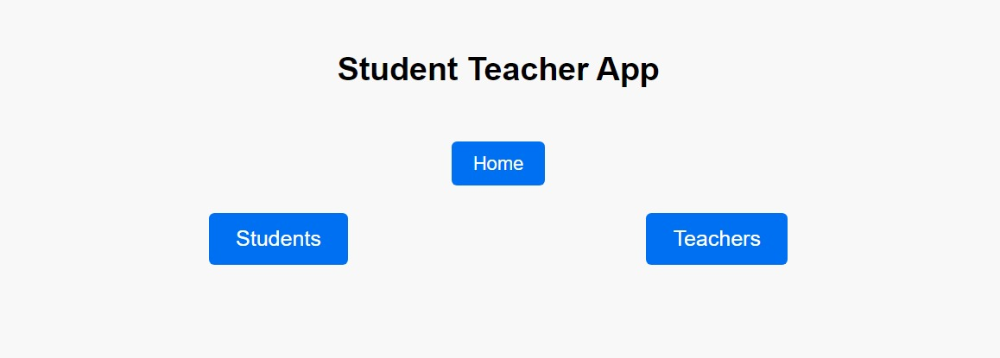
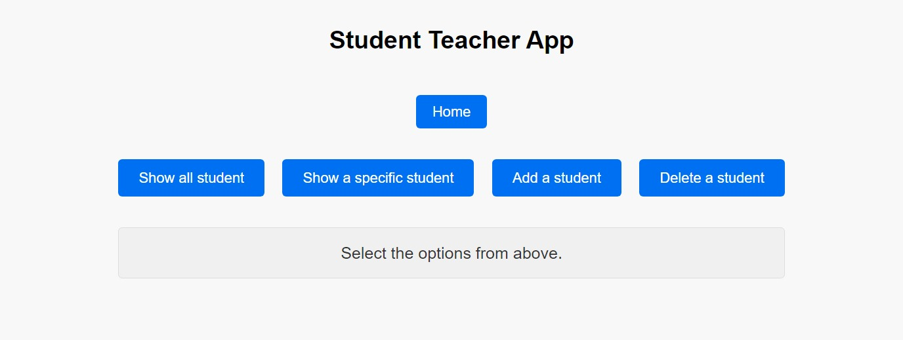
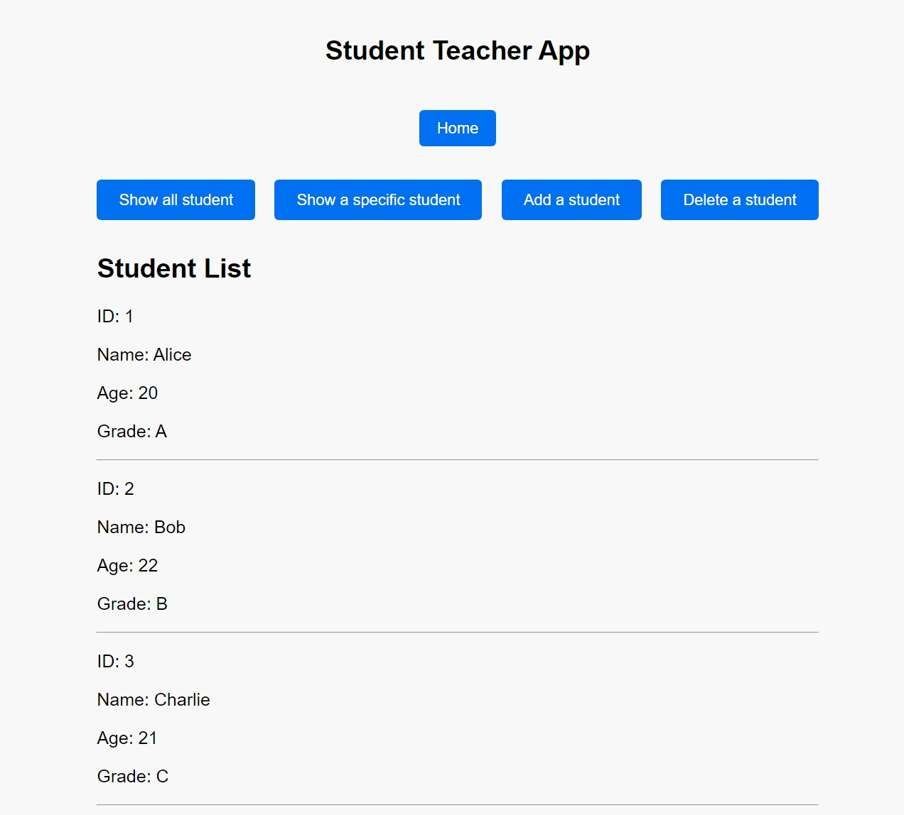
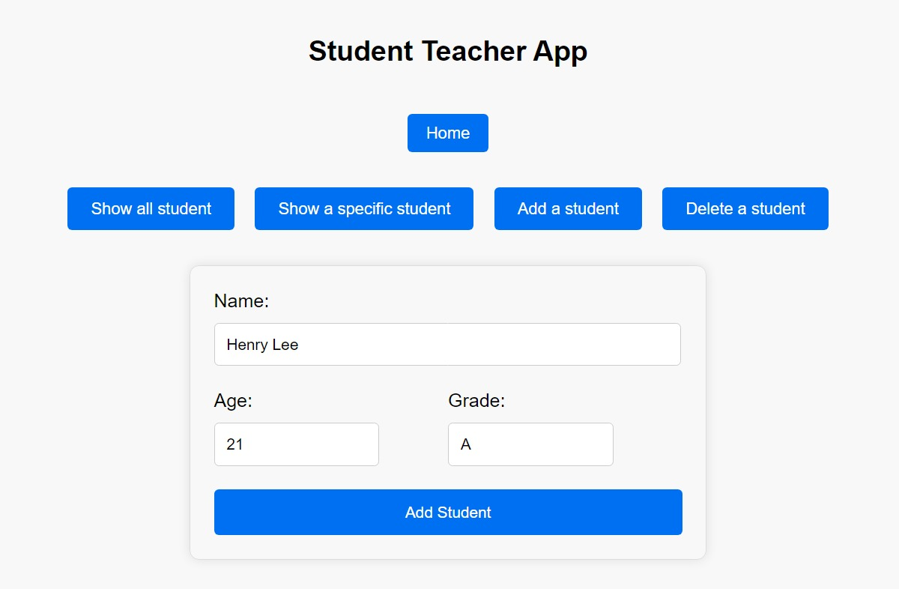
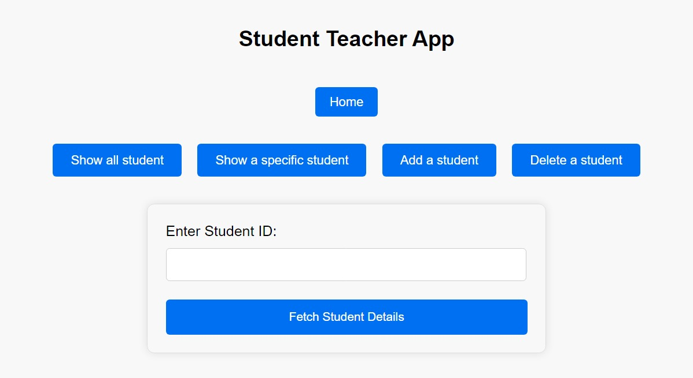

# My Next.js Project

Welcome to my Next.js project! This project demonstrates the basics of setting up a frontend and a server using Next.js. The project includes API routes to perform CRUD operations on a collection of students.

## Getting Started

1. Clone the repository:

    ```bash
    git clone https://github.com/harshm413/nextjs13-fullstack-basics-app.git
    ```

2. Navigate to the project directory:

    ```bash
    cd my-nextjs-project
    ```

3. Install dependencies:

    ```bash
    npm install
    ```

4. Run the project:

    ```bash
    npm run dev
    ```

5. Open your browser and visit [http://localhost:3000](http://localhost:3000) to see the app in action.

## Features

-   **Homepage**: Placeholder homepage.
-   **Students Listing**: Display a list of students.
-   **Student Detail Page**: View details of a specific student.
-   **API Routes**: Perform CRUD operations on the `students` resource.

## Technologies Used

-   Next.js
-   React

## Project Preview







## Contributing

Feel free to contribute to the project by submitting issues or pull requests. Your feedback is highly appreciated!

## License

This project is licensed under the MIT License - see the [LICENSE](LICENSE) file for details.

Happy coding! 🚀
